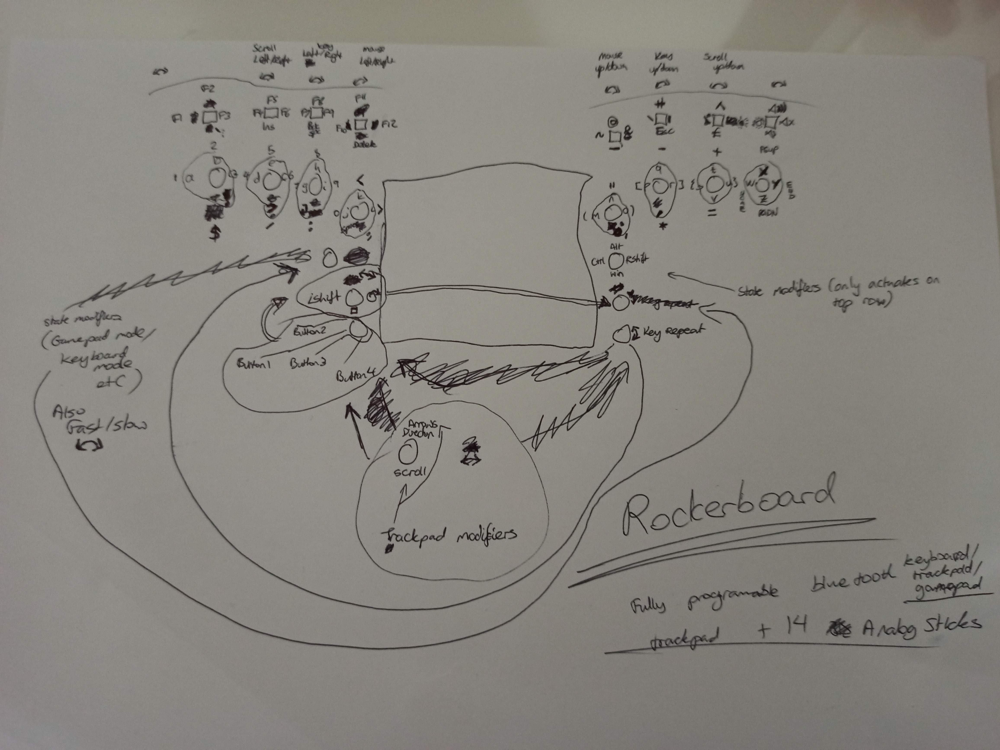

# RockerBoard
Programmable bluetooth Keyboard/Trackpad/Gamepad from just a directional trackpad and 14 analog sticks.

Inspiration comes from many chorded keyboard projects and https://www.charachorder.com/ in particular although no word chording is used in this project. Word chording is abandoned in favor of simplicity and reduced production costs. English(UK) is this projects default locale but it is intended that configurations could be made for and language or combination of languages.

The 3D analog sticks are intended to be similar to PSP analog sticks to keep this slim and compatible with potential integrations into laptops, but any could be used.

Additional ideas:
* Direction modes could function with normal analog directions in addition to the winding movement style. Perhaps analog joystick style motion for arrow keys and mouse movement could work on the currently empty finger slot (or swapped with scroll).
